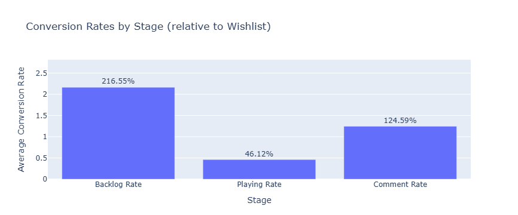

# Indie Game Conversion Analysis
A data visualization project exploring user behavior and genre trends in indie games.

## Overview
The project explores player engagement and conversion behavior in popular indie games using open data (1980-2023). It examines how users transition across game interaction stages, differences across genres, and how these trends evolve.

## Objectives
- Analyze conversion rates between wishlist, playing, and comment stages.
- Compare genre-level differences in conversion performance.
- Identify temporal patterns and potential structural shifts over time.

## Data
- source: Popular Video Games 1980 - 2023 (Excel, ~3MB)
- sample size: 285 games after cleaning
- Variables include: genre, release year, wishlist count, play count, comment count, etc.
- Raw data excluded from GitHub due to file size.

## Methodology
- Data cleaning and transformation using pandas and numpy
- Visualization with matplotlib, seaborn, and plotly
- Statistical validation using ANOVA, t-test, and correlation analysis

## Key Findings
- **User journey**: Conversion rates across different stages do not follow a hierarchical funnel with progressive attrition, suggesting diverse user behaviors rather than a uniform progression.
- **Genre differences**: Conversion rates differ significantly across genres (ANOVA F = 5.357, p < 0.001), with Visual Novel and Adventure games exhibiting higher consistency.
- **Temporal trend**: A decreasing trend with reduced variance is observed in the conversion rates of the top 5 genres over time. Further testing confirms a structural breakpoint around 2015 (T = 6.216, p < 0.001) and a significant decline in variance across all genres (r = –0.647, p = 0.031).

## Visualization

## Repository Structure
indie-game-conversion/  
│  
├── data/                 # (not included due to size; see Data section)  
├── notebooks/            # Jupyter notebooks for analysis  
├── outputs/              # Figure outputs  
│   ├── figures/              # Generated figures  
│   │   ├── static/           # Static plots (PNG)  
│   │   └── interactive/      # Interactive visualizations (HTML)  
├── requirements.txt      # Environment dependencies  
└── README.md             # Project documentation  

## How to Reproduce
1. Clone this repository:  
   git clone https://github.com/zhuoyingxie/indie-game-conversion.git  
   cd indie-game-conversion  
2. Create and activate a virtual environment:  
   python -m venv .venv  
   .\.venv\Scripts\activate  
3. Install dependencies:  
   pip install -r requirements.txt  
4. Run the notebook:  
   jupyter notebook notebooks/analysis.ipynb
